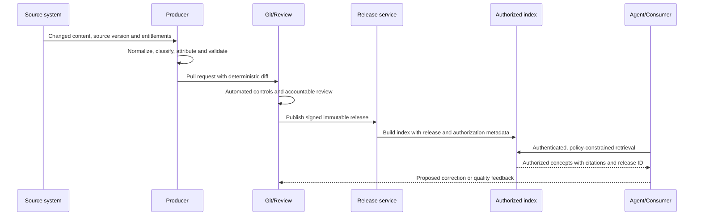

# Target Architecture

## 1. Architecture intent

The target architecture creates a controlled knowledge supply chain between
existing systems and agentic consumers. It separates six concerns:

1. authoring and operational systems;
2. extraction and normalization;
3. portable knowledge representation;
4. governance and release;
5. authorized serving and retrieval; and
6. agent or human consumption.

OKF owns concern 3. The adopting organisation must provide the production capabilities around
it.

## 2. Logical architecture

```mermaid
flowchart LR
    subgraph S[Authoritative and authoring systems]
        CF[Confluence]
        SP[SharePoint]
        YO[YODA]
        RA[RACK]
        CR[Code and API repositories]
        ES[Catalogs, CMDB, policy and records systems]
    end

    subgraph P[Knowledge producer plane]
        CN[Source connectors and change detection]
        NM[Normalization and concept decomposition]
        EN[Deterministic and AI-assisted enrichment]
        CL[Classification, DLP and entitlement mapping]
    end

    subgraph K[Controlled OKF knowledge plane]
        OR[Domain and access-aligned Git repositories]
        CI[Validation, policy checks and review]
        RL[Signed immutable release and manifest]
    end

    subgraph V[Serving and retrieval plane]
        GW[Authorized bundle gateway]
        LX[Lexical index]
        VX[Vector index]
        GX[Relationship or graph index]
    end

    subgraph C[Consumers]
        YC[YODA consumer capability]
        RC[RACK consumer capability]
        AG[Enterprise agents and copilots]
        PO[Search, portals and engineering tools]
        FB[Controlled feedback service]
    end

    S --> CN --> NM --> EN --> CL --> OR --> CI --> RL
    RL --> GW
    GW --> LX
    GW --> VX
    GW --> GX
    GW --> YC
    GW --> RC
    LX --> AG
    VX --> AG
    GX --> AG
    GW --> PO
    YC -. feedback .-> FB
    RC -. feedback .-> FB
    AG -. feedback .-> FB
    PO -. feedback .-> FB
    FB -. correction proposal .-> OR
```

The dotted feedback path creates a candidate change. It does not authorize a
consumer or agent to update a production bundle directly.

## 3. Component responsibilities

### 3.1 Source and authoring systems

These platforms remain authoritative according to the adopting organisation's existing records,
content, data, application, and service ownership policies. The OKF layer stores
an approved representation or reference, not necessarily the complete source
artifact.

| Source | Indicative role | Integration pattern |
|---|---|---|
| Confluence | Collaborative technical and operational content | API/webhook export, stable page identity, version and entitlement capture |
| SharePoint | Controlled documents, policies and procedures | Graph/API export, document/version identity, records and entitlement capture |
| YODA | Existing internal capability; exact role to validate | Producer, consumer, or both based on capability assessment |
| RACK | Existing internal capability; exact role to validate | Producer, consumer, or both based on capability assessment |
| Code/API repositories | Machine-readable contracts and engineering knowledge | CI-triggered generation and references to immutable commits |
| Catalogs/CMDB/records systems | Structured ownership, classification, service, data, and record metadata | Deterministic metadata export and canonical resource URIs |

### 3.2 Knowledge producer plane

The producer plane converts source changes into reviewable concepts.

Required functions include:

- incremental change detection using stable source identifiers and versions;
- deterministic extraction before optional AI enrichment;
- concept decomposition rather than arbitrary retrieval chunks;
- preservation of headings, tables, code, citations, and source anchors;
- deduplication and authoritative-source resolution;
- stable concept-path assignment;
- classification and entitlement derivation;
- source and content checksums;
- separation of generated and human-curated sections; and
- idempotent output so an unchanged source does not create noisy diffs.

AI enrichment may propose titles, summaries, tags, cross-links, or concept
boundaries. It must record its producer and model/version identity, retain source
attribution, and enter the normal review process.

### 3.3 Controlled OKF knowledge plane

The knowledge plane contains Markdown/YAML bundles aligned to both domain and
access boundaries. It provides:

- protected main branches;
- pull-request review and `CODEOWNERS`-style domain approval;
- machine validation against the VerityKF profile;
- secret, sensitive-data, malware, link, and policy scanning;
- source-drift and freshness checks;
- immutable release tags and artifacts;
- artifact digest and release manifest;
- retention and legal-hold integration where required; and
- complete audit events for production changes.

The Git repository is the controlled representation history. It does not
automatically become the legal record repository.

### 3.4 Serving and retrieval plane

The published release is transformed into consumer-specific views:

- a bundle gateway for file or concept retrieval;
- a frontmatter index for filtering and routing;
- lexical search for exact names, identifiers, and terminology;
- vector search for semantic discovery;
- an optional relationship index built from links and organisation-defined relationship
  metadata; and
- a release catalog recording available bundles, versions, schemas, digests,
  classifications, and compatibility.

Indexes are derived artifacts. Every indexed record must retain:

- bundle and release identifier;
- concept identifier and content hash;
- source and owner;
- lifecycle and freshness state;
- classification and authorization policy reference; and
- verification/trust information.

### 3.5 Consumer plane

Consumers use the release and metadata contract rather than binding directly to
each source format. A consumer must:

1. authenticate the user, workload, or agent;
2. authorize access before retrieval;
3. filter deprecated, stale, or insufficiently verified knowledge according to
   the use-case policy;
4. retain concept and source citations in the context;
5. record bundle releases and concept IDs in trace/audit events;
6. prevent instructions contained in source content from overriding system
   policy; and
7. handle missing, unknown, or broken links safely.

## 4. YODA and RACK integration decision tree

The proposal does not invent current capabilities for internal systems. Apply
the following mapping during discovery:

| Validated current responsibility | Target OKF responsibility |
|---|---|
| Authoring or curated system of record | Producer of approved concepts and source metadata |
| Metadata/catalog aggregator | Producer and optional release-catalog consumer |
| Enterprise search or RAG service | Consumer that indexes approved releases |
| Agent runtime or assistant experience | Consumer that retrieves and cites approved concepts |
| Workflow/approval platform | Orchestrates review but does not redefine OKF conformance |
| Operational execution platform | Remains executor; OKF documents or references its contracts |

If YODA and RACK overlap, architecture governance must assign one accountable
owner for each capability and prevent two mutable copies from both being called
authoritative.

## 5. Knowledge release and versioning model

Four identifiers must remain separate:

| Identifier | Purpose | Example |
|---|---|---|
| OKF specification version | Declares external syntax compatibility | `0.2` |
| VerityKF Enterprise Profile version | Declares enterprise-required schema and policy | `1.0` |
| Bundle release ID | Identifies immutable published knowledge | `global-technology-2026.08.21.1` plus Git SHA |
| Source/resource version | Identifies the upstream fact or document | SharePoint version, source commit, or catalog version |

The root `index.md` may declare `okf_version: "0.2"`. VerityKF Enterprise Profile and release
metadata should be declared in an accompanying release manifest and, where
appropriate, approved custom frontmatter.

Recommended rules:

- Use short-lived branches and pull requests for change.
- Publish only from a protected main branch.
- Do not use long-lived environment branches as release history.
- Promote the same immutable artifact through test and production.
- Pin each consumer to an explicit release or approved release channel.
- Record the previous release and provide automated rollback.
- Use profile major versions for consumer-breaking VerityKF profile changes.
- Use chronological immutable IDs for content releases; do not imply that a
  policy correction is equivalent to a software semantic-version change.

## 6. End-to-end publication flow

## 7. Deployment topology

The pilot may use a single controlled platform deployment, but the production
architecture should support:

- regional processing and storage where residency requires it;
- separate trust zones for public, internal, confidential, and restricted
  material;
- network-private producer and serving endpoints;
- organization-managed encryption keys where policy requires them;
- workload identity rather than static credentials;
- high availability for serving without requiring Git to be in the online
  request path;
- disaster recovery using immutable releases and reproducible indexes; and
- centralized telemetry with local content and entitlement enforcement.

## 8. Non-functional requirements

| Area | Requirement |
|---|---|
| Security | Deny by default; no source entitlement widening; secrets excluded |
| Audit | Record source version, concept, release, retrieval policy, consumer, and outcome |
| Availability | Online retrieval must not depend on the authoring platform or Git control plane |
| Recoverability | Rebuild derived indexes and roll back to a prior approved release |
| Integrity | Verify release digest/signature before ingestion and serving |
| Performance | Support progressive disclosure and filtered retrieval without loading whole bundles |
| Scalability | Partition by domain/access boundary and support incremental indexing |
| Interoperability | Preserve valid OKF fields and tolerate unknown extension fields |
| Maintainability | Deterministic generation, small concepts, stable IDs, low-noise diffs |
| Observability | Measure freshness, quality, authorization denials, source drift, indexing state, and consumption |
| Portability | Consumers must not require a proprietary source API to interpret an approved concept |

## 9. Architecture constraints and cautions

- OKF concept identity is based on the file path. Renames require redirects,
  aliases, or an organisation-defined stable-ID extension.
- Standard Markdown links create untyped graph edges. Typed relationships require
  a VerityKF extension while preserving normal links for interoperability.
- Broken links are tolerated by the base specification; an adopting organisation may enforce
  stricter rules for production releases.
- A Git repository containing hundreds of thousands of concepts may require
  domain partitioning and sparse/incremental build strategies.
- Source content is untrusted input to an agent. Publishing it as OKF does not
  eliminate prompt injection, malicious links, or data-exfiltration risk.
- OKF attestation records how a computation may be checked; it does not execute
  it. The v0.2 specification defers parts of the runtime protocol and attester
  ABI, so production use requires an organisation-owned design and assurance process.
